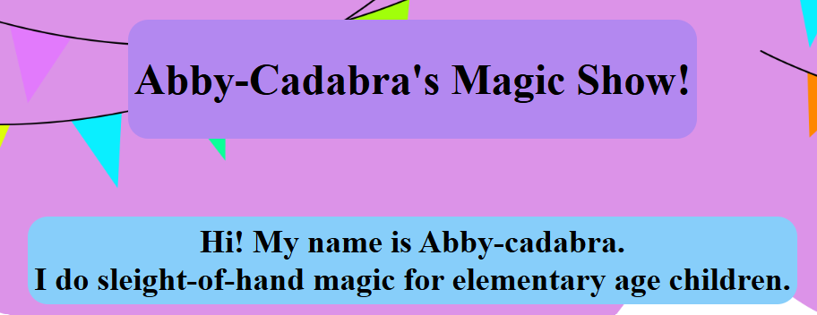

# Abby-cadabra Magic Show
A website advertising a kids magic show.

**[Visit abby-cadabra.org](https://abby-cadabra.org)**

## Quickstart
Visit [abby-cadabra.org](https://abby-cadabra.org)!

## Features
- Home page for a kid's magic show
- Portfolio of combat robot design
- Page explaining The Four
- Custom 404 page
- Working on optimization for mobile and desktop

## Design decisions
While this project started out as a simple, one page website to learn how to use HTML and
advertise a kids's magic show, it has expanded to be that and a personal portfolio of my
combat robotics projects and a page to link to from my sticker design explaining
[The Four](https://thefour.fca.org/).

## Credits
I referenced the [W3Schools CSS page](https://www.w3schools.com/Css/default.asp) a lot while making this.

I also looked at some other personal websites and their source code from [Stardance.](https://stardance.hackclub.com/missions/personal-page)
